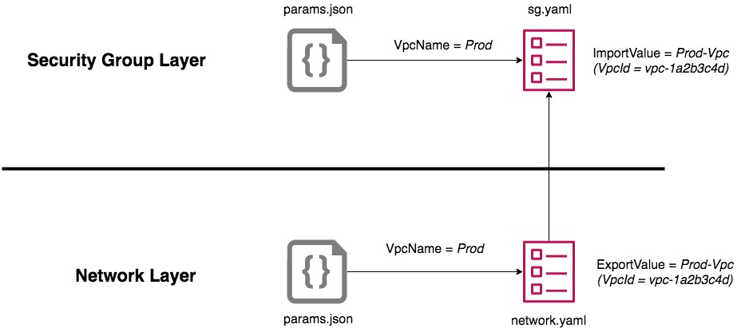

# CloudFormation Layering Example




This example shows how multi layered CloudFormation templates work.   

There are two CloudFormation templates. The first template is `network.yaml`. This template creates typical VPC and subnet, gateway, so on, **PLUS** exports VPC ID so that security group tempalte(`sg.yaml`) can create secuirty group WHTHOUT specifing VPC ID in the sg.yaml. 

With using this techinique, you can keep your CloudFormation template small, simple. 

## Quick Start
1. Install [AWS CLI](https://aws.amazon.com/cli/?nc1=h_ls)  
2. Get your [AWS credential](https://docs.aws.amazon.com/cli/latest/userguide/cli-configure-files.html).   
If you have no idea where the AWS credential is, ask you AWS admin.

2. Create ```Network``` stack.　　
```
aws cloudformation create-stack \
--stack-name Network \
--template-body file://./network/network.yaml \
--cli-input-json file://.//network/params.json
```
3. Then create ```Security Group``` stack.
```
aws cloudformation create-stack \
--stack-name Sg \
--template-body file://./sg/sg.yaml \
--cli-input-json file://./sg/params.json
```

