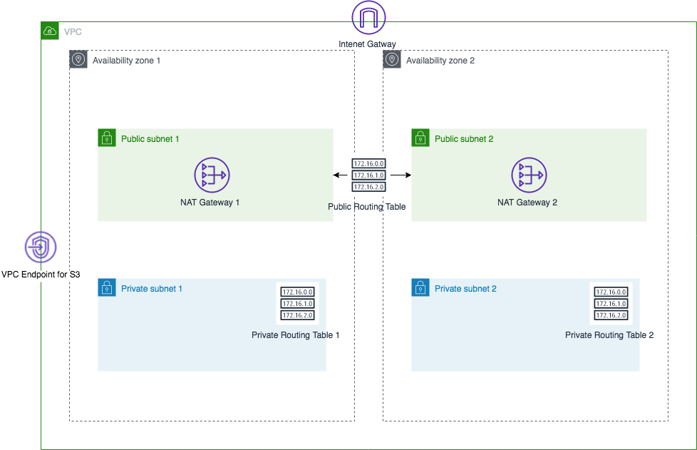

# Plain AWS Network Stack


CloudFormation Template for the very typical VPC network configuration. 

## Getting Start
1. Install [AWS CLI](https://aws.amazon.com/cli/?nc1=h_ls)
2. Execute following command　　
```
aws cloudformation create-stack \
--stack-name NetworkStack \
--template-body file://network.yaml \
--cli-input-json file://params.json
```

## Customize
In `params.json`, you can configure you desired CIDR block for you VPC. 


| Parameter | Description |
----|---- 
| VpcCidr | CIDR block for the VPC. |
| VpcName | The name for the VPC and resouces. The parameter affects tagging for each resources as `VpcName`-ResourceName. You can use this parameter for devideing environment for example `Prod` and `Dev`. |  

You might notice that you didn't specifiy subnet's CIDR, here is the trick. In the template file,
```
      CidrBlock: !Select
        - 0
        - !Cidr [ !GetAtt 'Vpc.CidrBlock', 16, 8 ]
```

This will calculate subnet's CIDR block '/24' from VPC CIDR you specified in the `params.json`. For more detail, please see [AWS Documentation](https://docs.aws.amazon.com/AWSCloudFormation/latest/UserGuide/intrinsic-function-reference-cidr.html).